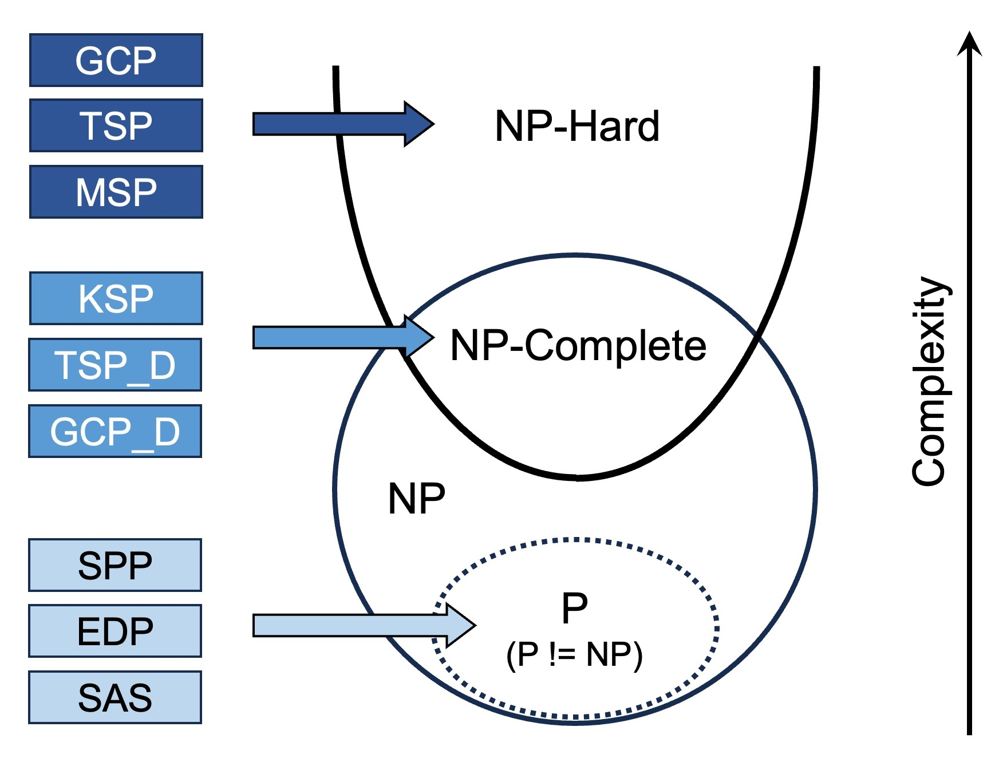

# NPHardEval: Dynamic Benchmark on Reasoning Ability of Large Language Models via Complexity Classes


## Overview
NPHardEval serves as a comprehensive benchmark for assessing the reasoning abilities of large language models (LLMs) through the lens of computational complexity classes. This repository contains datasets, data generation scripts, and experimental procedures designed to evaluate LLMs in various reasoning tasks.
<div align="center">
    
</div>

## Key Takeaways
In general, our benchmark offers several advantages compared with current benchmarks:
* The questions in the benchmark utilized are grounded in the established computational complexity hierarchy, a concept extensively studied in theoretical computer science. This foundation enables us to leverage existing research to rigorously and quantitatively measure an LLM's logical reasoning extent.
* We incorporate automatic checking mechanisms for these questions, as they are based on algorithmically computable problems. Human intervention is not required to determine the correctness of the LLM's responses.
* The method allows for the automatic generation of questions so that we can update the benchmark on a monthly basis. This monthly-refreshed benchmark helps prevent model's overfitting as we can always generate novel questions with varying difficulty levels for evaluation.
* The benchmark excludes numerical computation from the questions, which is notably difficult for LLM. This focus allows for a more accurate evaluation of an LLM's pure logical reasoning ability, as numerical computation can obscure this assessment.
* Our methodology offers insights into a long-standing and intriguing question within the field: the degree to which LLMs are capable of tackling problems classified as NP-hard or NP-complete.

In addition to developing the benchmark, we compare different foundation models' reasoning ability across task complexity and experimented with different prompt styles to understand their in-context learnability. Our study reveals a notable disparity in performance between closed-source and open-source models not only on general reasoning ability but also the disparity between "learning" and "mimicking". In particular, we found:

* **Reasoning Ability of Foundation Models Decay Hugely at the NP-Hard Complexity Level**: All models exhibit decreased accuracy and increased failure rates with rising task complexity, especially at NP-Hard levels.
[Add Figure 3]

* **Varied Impact on Model Performance**: There are reasoning ability gaps among foundation models. The transition from P to NP-Complete complexity impacts models differently, with GPT 4 Turbo showing the leading performance across different questions; Claude 2 and GPT 3.5 Turbo demonstrates great performance in some tasks, while showing significant performance shifts and strengths in others. Open models are often less capable of reasoning in complex tasks and difficult questions, while Mistral-7b and Yi-34b demonstrate equal reasoning abilities in some tasks as the close source models. 
[Add Figure 2]

* **Generalization through In-context Learning**: The model performances vary across few-shot examples' difficulties. Closed-source models like GPT 4 Turbo and Claude 2 maintain consistent performance across difficulty levels, indicating robust learning from few-shot examples, while open-source models vary in adaptability.
[Add Figure 6]

## Leaderboard
[Add a table]

## Environment setup
### Install environments
```bash
conda create --name llm_reason python=3.10
conda activate llm_reason
git clone https://github.com/casmlab/NPHardEval.git
pip install -r requirements.txt
```

### Set-up API keys
Please set up your API keys in `secrets.txt`. **Please don't directly upload your keys to any public repository.**

### Quick Start
Let's use the GPT 4 Turbo model (GPT-4-1106-preview) and the EDP for example. 

For its zeroshot experiment, you can use:
```python
python run_close_zeroshot/run_hard_GCP.py gpt-4-1106-preview
```

For its fewshot experiment, 
```python
python run_close_fewshot/run_hard_GCP.py gpt-4-1106-preview self
```
We currrently support fewshot examples from the same question (self), and may support examples from other questions (other) in the future.

## Dataset
**Directory:** `Data`

The `Data` directory houses the datasets utilized in our study, categorized into `Fewshot` and `Zeroshot` datasets, corresponding to their respective experimental setups.

**Structure:**
```bash
$ tree -d Data 
Data
├── Fewshot
│   └── FewshotExample
└── Zeroshot
    ├── BSP
    ├── EDP
    ├── GCP
    ├── GCP_Decision
    ├── KSP
    ├── MFP
    ├── MSP
    ├── SPP
    ├── TSP
    └── TSP_Decision
```

### Data
The data used is under `data` directory. You can find the zeroshot/fewshot under the corresponding directory. They are the data used in our report.


## Dataset Generation
**Directory:** `generate`

In the generate directory, scripts for creating data instances tailored to different reasoning tasks are provided. These scripts are essential for generating both zero-shot and few-shot test questions. Additionally, we include utility functions for validating generated instances, ensuring quality and relevance.

**Special Mention for Fewshot Data Generation:**
Under `generate/answer_generate`, we provide templates for creating few-shot examples, offering guidance for extending this methodology to additional reasoning tasks.

**Structure:**
```bash
$ tree generate
generate
├── __init__.py
├── answer_generate
│   ├── answer_p_mfp.py
│   ├── answer_p_spp.py
│   └── generate_fewshot.py
├── check_spp_mfp_instance.py
├── generate_cmp_GCP_D.py
├── generate_cmp_KSP.py
├── generate_cmp_TSP_D.py
├── generate_hard_GCP.py
├── generate_hard_MSP.py
├── generate_hard_TSP.py
├── generate_p_BSP.py
├── generate_p_EDP.py
├── generate_p_MFP.py
└── generate_p_SPP.py
```


## Experiments
To successfully replicate the experiments detailed in this repository, the following prerequisites must be met:

1. **Access to Large Language Model (LLM) APIs**: Essential for interfacing with the LLMs under evaluation.
2. **Datasets**: Located in the `Data` directory, these datasets are vital for conducting both zero-shot and few-shot experiments.
3. **Script Utilization**: Scripts located in the `run` directory are designed to facilitate the experimental process. This repository is meticulously organized to support distinct experimental approaches for zero-shot and few-shot scenarios.

### Execution Script
**Directory:** `run` \
**File**: `run.sh`

This script is your primary tool for experiment execution. It is meticulously crafted to provide a seamless and efficient experimental workflow. Detailed instructions within `run.sh` guide users through each step of the process, ensuring a smooth and error-free execution.

```bash
$ tree run    
run
├── models.py
├── prompts.py
├── run.sh
├── run_close_fewshot
│   ├── run_p_BSP.py
│   ├── run_p_EDP.py
│   ├── run_p_MFP.py
│   └── utils.py
├── run_close_zeroshot
│   ├── run_cmp_GCP_D.py
│   ├── run_cmp_KSP.py
│   ├── run_cmp_TSP_D.py
│   ├── run_hard_GCP.py
│   ├── run_hard_MSP.py
│   ├── run_hard_TSP.py
│   ├── run_p_BSP.py
│   ├── run_p_EDP.py
│   ├── run_p_MFP.py
│   ├── run_p_MFP_more.py
│   ├── run_p_SPP.py
│   ├── run_p_SPP_more.py
│   └── utils.py
└── run_open
    ├── __init__.py
    ├── run_cmp_GCP_D.py
    ├── run_cmp_KSP.py
    ├── run_cmp_TSP_D.py
    ├── run_hard_GCP.py
    ├── run_hard_MSP.py
    ├── run_hard_TSP.py
    ├── run_p_BSP.py
    ├── run_p_EDP.py
    ├── run_p_MFP.py
    ├── run_p_SPP.py
    └── utils.py
```


### Answer Verification
**Directory**: `check`

Contained within this directory are utility functions crucial for verifying answers provided by the LLMs. These functions are automatically invoked during experiments executed via `run.sh`. As the experiment progresses, these utilities rigorously evaluate the responses from LLMs and compile the outcomes in the `Results` directory. This automated process ensures a comprehensive and objective assessment of the LLM's performance.


## Analysis
**Directory:** `summary`

This directory primarily focuses on the visualization and analysis of data related to the performance of Large Language Models (LLMs). It includes two key components:

**Jupyter Notebooks**: `result_complexities.ipynb` analyzes the accuracy rates of LLMs across various question complexity classes, while `result_problems.ipynb` examines specific problem instances and their solutions as processed by LLMs.

**Source Code** (`src` sub-directory): This sub-directory contains Python scripts dedicated to the visualization and analysis of ablation studies and research questions (RQs). The scripts, named as `visualize_ablation*.py` and `visualize_rq*.py`, provide detailed insights into different aspects of LLM performance and characteristics.

Overall, the summary directory serves as a comprehensive hub for assessing and understanding the efficacy of Large Language Models in handling questions of varying complexities and types.

## News
-[2023.12.24] We release the initial version of NPHardEval, with data, generation code, answer-checking code, and run files


## Citation


